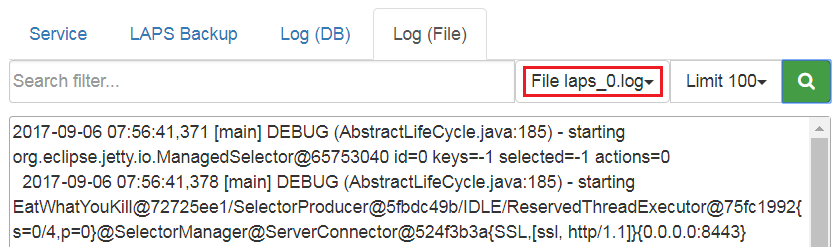

LAPS Portal maintenance
=======================

LAPS Portal restarting
----------------------
To restart LAPS portal you can use:

* on unix systems::
	
	service laps restart

* on windows systems::
	
	open services.msc and restart laps service
	
* via LAPS Portal GUI. Go to **Administration -> System -> Service** and press "Restart" button
 
Log files
---------

LAPS portal creates following log files: 

* logs/laps*.log
* logs/wrapper.log

You can view logs of LAPS Portal in **Administration -> System ->Log(File)**, select log file and press "Search" button

engine.conf file
----------------

File conf/engine.conf is JSON file which contains basic configuration options

.. list-table::
  :header-rows: 1

  * - **Option**
    - **Value type**     
    - **Description**     
  * - basepath
    - string
    - path to directory where LAPS portal is located. This parameter is automatically filled by LAPS Portal itself
  * - init_completed
    - boolean
    - flag which is set to true after first launching when default settings are configured
  * - sslport
    - string
    - port used by LAPS Portal to serve TLS connection
  * - keystore_pass 
    - string
    - password for java ket storage file 
  * - jetty_cert_alias 
    - string
    - alias of certificate which will be used by TLS engine
  * - jdbc_driver 
    - string
    - jdbc driver wor database management system used by LASP Portal
  * - db_host 
    - string
    - databse host
  * - db_port 
    - int
    - databse port
  * - db 
    - string
    - database name
  * - db_username 
    - string
    - database user
  * - db_password 
    - string
    - database password

LAPS Portal backup
------------------
To restore LAPS portal you should backup following files:

* conf/engine.conf (in case you modified default network port)
* conf/confdb.db – internal sqlite database which contains settings and event logs
* conf/license.txt - license activation file
* keystore/keystore.jks – certificate store
* backups/laps/* - backup files with passwords of computers managed by LAPS
* wrapper/conf/wrapper.conf – service/daemon configuration 
* bin/log4j.properties – log level properties

Admin password reset
--------------------
If you forget admin password you can reset it in following way:

* on windows systems::
	wrapper/bat
	runConsole.bat resetpass

* on unix systems:: 
	wrapper/sh
	./runConsole.sh resetpass

Errors
------
AcceptSecurityContext
^^^^^^^^^^^^^^^^^^^^^^^^^^^^^^^^
AcceptSecurityContext error can appear during establishing connection to ActiveDirectory:: 

	[LDAP: error code 49 - 80090308: LdapErr: DSID-0C0903A9, comment: AcceptSecurityContext error, data 52e, v1db1

For error code 49 reason of error shown in data field 

.. list-table::
  :header-rows: 1

  * - **data field code**
    - **description**     
  * - 525
    - User not found   
  * - 52e
    - Wrong password
  * - 530
    - not allowed to login at this time
  * - 531 
    - no access right to login to this computer
  * - 532 
    - password expired
  * - 533
    - user account disabled
  * - 701
    - user account expired
  * - 773 
    - password reset is required
  * - 775
    - user account is locked

SSLHandshakeException
^^^^^^^^^^^^^^^^^^^^^
javax.naming.CommunicationException javax.net.ssl.SSLHandshakeException indicates that LAPS Portal could not validate certificate chain during SSL/TLS hadshake. In case of following errors::
  
  javax.naming.CommunicationException: simple bind failed: server.local:636 [Root exception is javax.net.ssl.SSLHandshakeException: sun.security.validator.ValidatorException: PKIX path building failed: sun.security.provider.certpath.SunCertPathBuilderException: unable to find valid certification path to requested target]

You should check whether all certificate chain imported into LAPS Portal. After importing certificates do not forget to restart LAPS Portal service.

In case this error appears during communication with AD Controllers you should also check how many certificates domain controller has with Server Authentication purpose. In normal situation AD Controller should have one personal certificate with Server Authentication purposes . According to https://social.technet.microsoft.com/wiki/contents/articles/2980.ldap-over-ssl-ldaps-certificate.aspx *"You should be planning on having only one certificate on each LDAP server (i.e. domain controller or AD LDS computer) with the purpose of Server Authentication. If you have legitimate reasons for using more than one, you may end up having certificate selection issues, which is discussed further in the Active Directory Domain Services Certificate Storage.* As workaround import all certificates with Server Authentication purposes  to LAPS Portal
